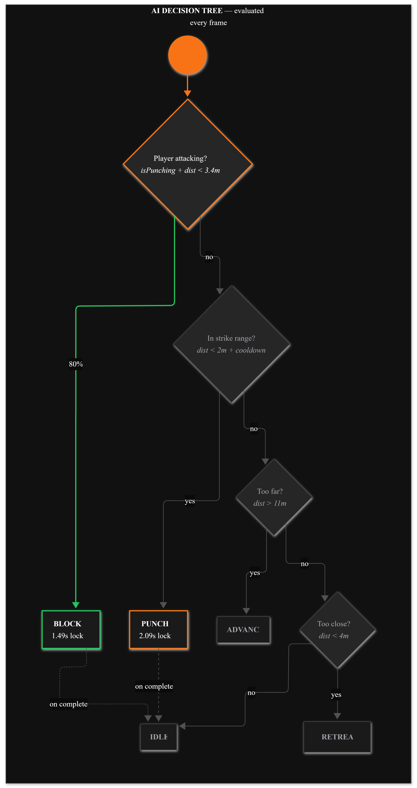
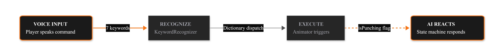

# Voice-Controlled Combat Game

A Unity fighting game where players control their character entirely through voice commands. Built as an accessibility-focused input design experiment exploring alternative control schemes for action games.


*Voice command "punch" triggers attack animation in real-time*

## Download

**[⬇️ Download Playable Build (Windows)](https://github.com/tylervaracchi/voice-controlled-combat-game/releases/latest)**

## The Problem

Traditional fighting games require precise, fast inputs on controllers or keyboards. This creates barriers for:
- Players with motor disabilities
- Situations where hands-free control is needed
- Exploring novel interaction paradigms

## The Solution

This project implements a complete voice-controlled combat system using Windows Speech Recognition. Players speak commands like "punch," "kick," and "block" to control their fighter in real-time against an FSM-driven AI opponent.

### Voice Commands

**In-Game Combat:**
| Command | Action |
|---------|--------|
| "advance" | Move forward |
| "back" | Move backward |
| "jump" | Jump |
| "punch" | Punch attack |
| "kick" | Kick attack |
| "upper cut" | Uppercut attack |
| "block" | Defensive block |

**Menu Navigation:**
| Command | Action |
|---------|--------|
| "play" | Start game |
| "quit" | Exit application |
| "left" / "right" | Select character |
| "upper" / "lower" | Select environment |
| "fight" | Begin match |

## System Architecture



The voice input pipeline:
1. **Windows Speech Recognition** captures microphone input
2. **KeywordRecognizer** matches against registered command vocabulary
3. **Action Mapping** translates recognized phrases to game actions
4. **Animator Controller** executes the corresponding animation and gameplay logic

## Technical Implementation

### Voice Recognition System

Uses Unity's `KeywordRecognizer` wrapping the Windows Speech Recognition API:

```csharp
// Map voice commands to game actions
voiceCommands.Add("punch", Punch);
voiceCommands.Add("kick", Kick);
voiceCommands.Add("block", Block);

keywordRecognizer = new KeywordRecognizer(voiceCommands.Keys.ToArray());
keywordRecognizer.OnPhraseRecognized += OnVoiceCommandRecognized;
keywordRecognizer.Start();
```

Key design decisions:
- **Command vocabulary**: Short, distinct words to minimize recognition errors
- **Action queuing**: Commands trigger immediately without confirmation for responsive gameplay
- **Graceful degradation**: Traditional input system available as fallback
- **Proper cleanup**: KeywordRecognizer disposed on destroy to prevent memory leaks

### AI Opponent (Finite State Machine)



The AI uses a state machine with tactical decision-making:

```
States: Idle → MoveForward → MoveBackward → Punch → Block

Decision Priority:
1. Block if player attacking AND in range (80% probability)
2. Attack if in range AND cooldown elapsed  
3. Close distance if too far
4. Create distance if too close
5. Idle
```

The AI evaluates:
- Distance to player
- Current health values
- Player attack state
- Cooldown timers

### Combat System

- **Hit Detection**: Collision-based with animation state validation
- **Damage Calculation**: Variable damage per attack type (punch: 10, kick: 5, uppercut: 15)
- **Block Mechanic**: 75% damage reduction when blocking
- **Health Management**: Centralized manager with UI health bar updates
- **Round System**: Best of 3 rounds with position reset between rounds

### Project Structure

```
Assets/Scripts/
├── Player/
│   └── PlayerController.cs      # Voice input + character control
├── AI/
│   └── AIController.cs          # FSM opponent logic
├── Camera/
│   └── CameraManager.cs         # Third-person camera with mouse orbit
├── Game/
│   ├── Health.cs                # Per-character health component
│   ├── HealthManager.cs         # Centralized health + UI management
│   ├── HitDetection.cs          # Collision-based damage system
│   ├── ScoreManager.cs          # Persistent win/loss tracking
│   └── SceneController.cs       # Voice-controlled scene navigation
└── UI/
    ├── PlayerHUDManager.cs      # In-game HUD, timer, pause menu
    └── ChooseScreenManager.cs   # Voice-controlled character select
```

## Requirements

- Unity 2021.3 or later (for development)
- Windows 10/11 (for Speech Recognition API)
- Microphone

## Setup (Development)

1. Clone this repository
2. Open in Unity
3. Ensure your microphone is set as default recording device
4. Enter Play mode and speak commands

## Limitations & Future Work

**Current limitations:**
- Windows-only (uses `UnityEngine.Windows.Speech`)
- English commands only
- Requires quiet environment for reliable recognition

**Potential improvements:**
- Cross-platform voice recognition (e.g., Whisper, Google Speech API)
- Command confirmation mode for accessibility
- ML-based AI opponent trained on player patterns
- Multiplayer voice-controlled matches
- Localized voice commands

## Author

**Tyler Varacchi**  
Technical Artist  
[Portfolio](https://tylervaracchi.com) · [LinkedIn](https://linkedin.com/in/tyler-varacchi) · [GitHub](https://github.com/tylervaracchi)

## License

**All Rights Reserved** — This code is provided for viewing and portfolio demonstration only. See [LICENSE](LICENSE) for details.
